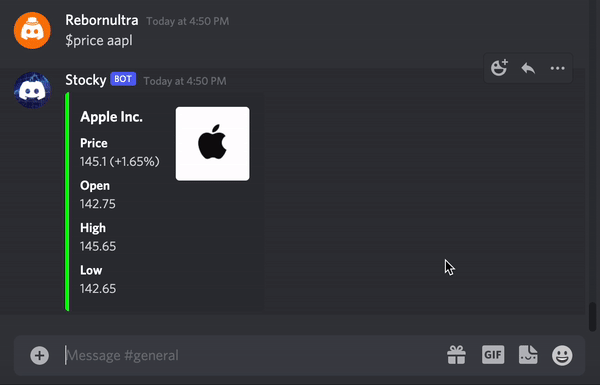
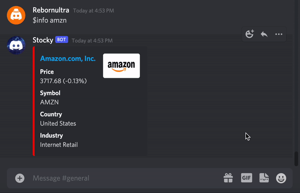
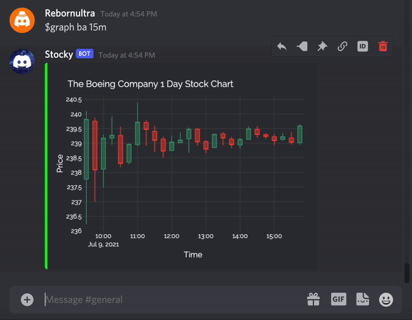

<br />
  <p align="center">
  <a href="https://github.com/Momin-C/Stocky">
    
  </a>

  <h2 align="center">Stocky</h2>
  <p align="center">
    Real-time and historical quantitative Discord Bot for information, prices and graphs regarding stocks listed on American and Canadian stock exchanges
    <br />
    <br />
    <a href="https://github.com/Momin-C/Stocky/issues">Report Bug</a>
  </p>
</p>

[![Issues][issues-shield]][issues-url]
[![MIT License][license-shield]][license-url]
[![LinkedIn][linkedin-shield]][linkedin-url]

## Table of Contents

* [About the Project](#about-the-project)
    * [Developed Using](#developed-using)
* [Demos](#demos)
* [Getting Started](#getting-started)
    * [Prerequisites](#prerequisites)
    * [Setting Up The Bot](#setting-up-the-bot)
* [Contributing](#contributing)
* [References](#references)
* [Contact](#contact)

## About The Project

Stocky allows you to view the price of stocks listed on US and Canadian Stock Exchanges in real-time. The bot gives daily graphs, info, daily numbers and more for any stock desired, all through simple easy-to-use commands!

### Developed Using
This project was developed using the Yahoo! Finance API and the Discord.py module.
* [Yahoo! Finance](https://pypi.org/project/yfinance/)
* [Discord.py](https://discordpy.readthedocs.io/en/stable/)

## Demos

GIFs of some commands can be found below.
Using the `$price` command



Using the `$info` command



Using the `$graph` command



## Getting Started

### Prerequisites
To use this bot, some packages need to be installed, download these packages from your terminal
```sh
pip3 install discord.py
pip3 install yfinance==0.1.62
pip3 install plotly
pip3 install kaleido
```
For best results when graphing, install the [Raleway](https://fonts.google.com/specimen/Raleway) font.

Then clone the repository

```sh
git clone https://github.com/Momin-C/Stocky.git
```

### Setting up the bot
Once the repository has been cloned, the bot must be activated using the discord developer portal. Either use the instructions written below or follow this [video](https://youtu.be/Uibz0iQjoC0?t=692) 


1. Go to the Discord developer portal [application website](https://discord.com/developers/applications)
2. Click New Application and add a name
3. Click the bot menu on the left and click "Add Bot"
4. Set the bot username to "Stocky" and use the logo in the images directory as the bot's picture
5. Go to the [bot permission website](https://discordapi.com/permissions.html) and select read messages, send messages, embed links and attach files
6. Under the permissions, paste the application ID which can be found on the "General Information" section of the discord developr portal
7. Click the link given and add the bot to your server
8. Right-click the "General" text channel and copy the channel ID, paste this into the file ChannelID.txt, making this the file's only contents
9. On the discord developer portal bot site, copy the token and then paste it in the file ClientID.txt, making this the file's only contents
10. Run the Stocky.py python file for the bot to be active

## Contributing

If you have any ideas on how to improve Stocky, make a contribution!

1. Fork the project
2. Create a new branch (`git checkout -b update`)
3. Commit your changes (`git commit -m 'Description of update'`)
4. Push to the branch (`git push origin update`)
5. Open a new pull request

## References

* Thanks to [Ajay Gandecha](https://www.youtube.com/watch?v=Uibz0iQjoC0) for instructions on how to set-up a Discord bot
* Credit to othneildrew for the [README template](https://github.com/othneildrew/Best-README-Template/blob/master/BLANK_README.md)

## Contact

Momin Chaudhry - [@momin_c](https://instagram.com/momin_c) - hellomomins@yahoo.com

[issues-shield]: https://img.shields.io/github/issues/Momin-C/Stocky
[issues-url]: https://github.com/Momin-C/Stocky/issues
[license-shield]: https://img.shields.io/github/license/Momin-C/Stocky
[license-url]: https://github.com/Momin-C/Stocky/blob/master/LICENSE
[linkedin-shield]: https://img.shields.io/badge/-LinkedIn-black.svg?style=flat-square&logo=linkedin&colorB=555
[linkedin-url]: https://www.linkedin.com/in/momin-chaudhry/